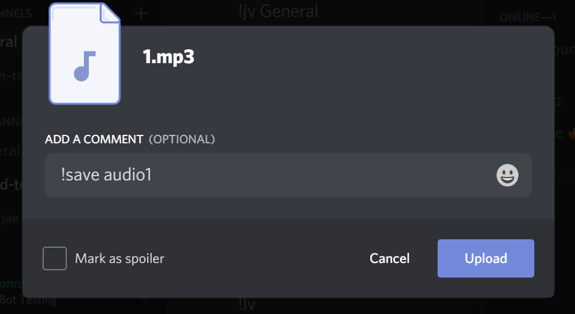
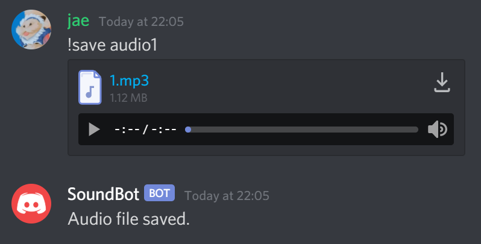
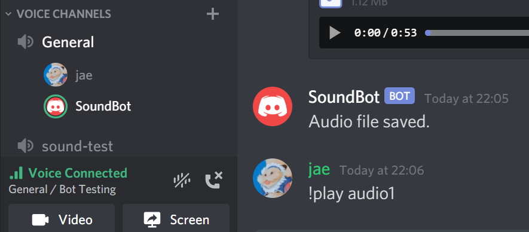

# audio-bot
Repository for a discord bot that saves and plays audio files.

- !save *sound name*: this is used to save the audio file

- !play *sound name*: when this is typed into chat, the bot will join the General voice chat and play the sound

- !lv: as an admin, you can make the bot leave voice chat after it is done playing its sounds 
